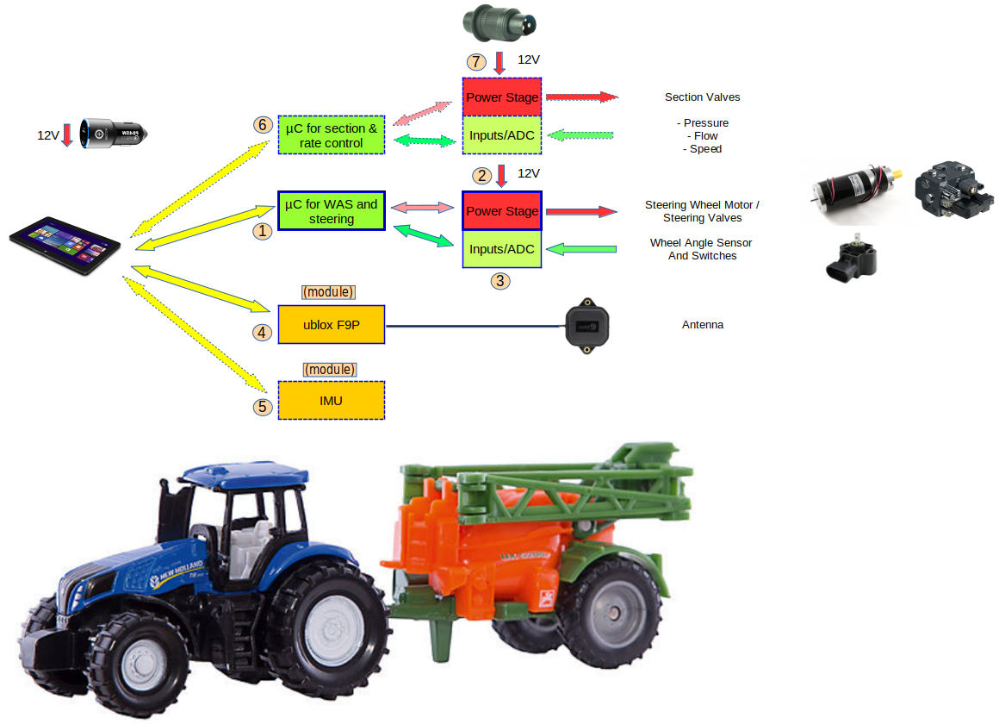
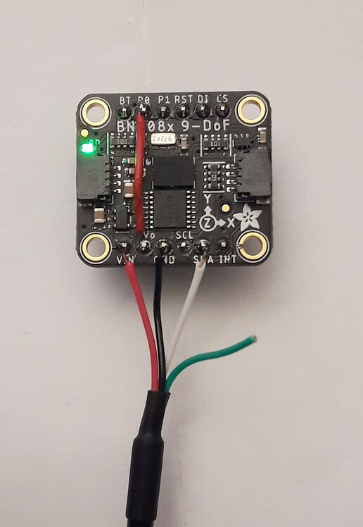
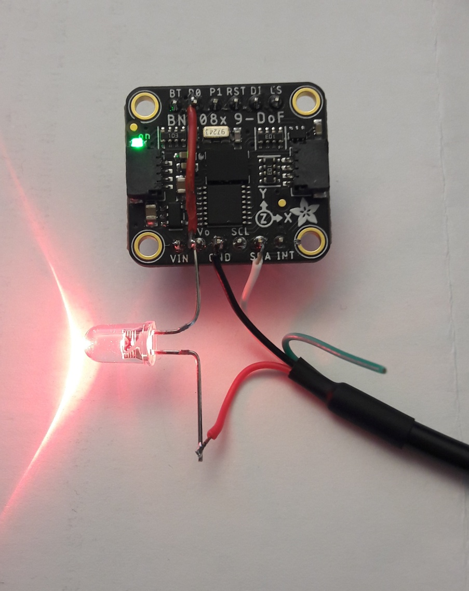
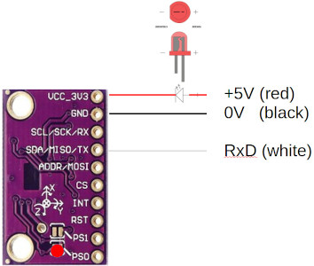
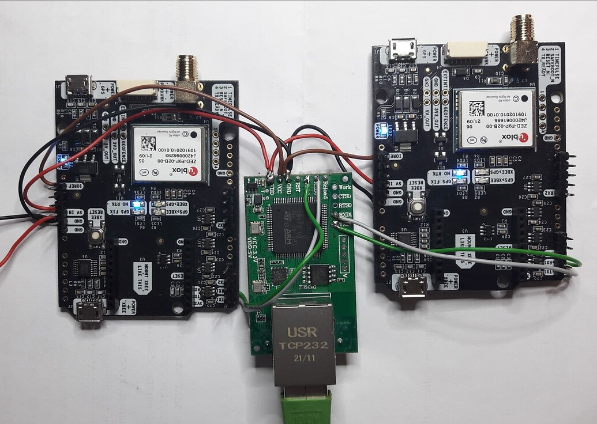

### What is "AgOpenGPS"?
AgOpenGPS "AOG" is an open-source project initiated by the Canadian [Brian Tischler](https://www.astech.ca/archives/indexofpastwinners/tischler-brian). It started as parallel driving aid and mapping software for Windows(TM) and turned into a full-control system for steering including section and rate control. Today, many peaceful people from all over the world collaborate and contribute to the project. 

The communication part of the software is called AgIO, and AgDiag is the software part showing an overview about all values exchanged between software and hardware. 

On the hardware side, there are several different solutions for the same job, beginning from just plugging readily available module together to the hardware designs provided in this repo for professional prototyping production, which supports all functions of AgOpenGPS in a dedicated design. 

All code is published under the [GNU general public license V3.0](https://www.gnu.org/licenses/gpl-3.0.html) on [Github](https://github.com/farmerbriantee/AgOpenGPS).

All hardware in this repository is published under the [Cern-OpenHardwareLicense-S-2.0](https://cern-ohl.web.cern.ch/).

This text is published under the non-commercial share-alike [Creative Commons License V4](https://creativecommons.org/licenses/by-nc-sa/4.0/deed.en).

All this keeps the project open for everyone in the future. Everyone is allowed to copy and produce everything of this project, but has to open her/his mods for the community in return.

This document describes the system and the hardware. A description of the software itself comes with [the manual embedded in the AgOpenGPS software packet.]([https://github.com/farmerbriantee/AgOpenGPS/releases)

Join the [AgOpenGPS forum](https://discourse.agopengps.com/) for further help and discussions.

>### Important Functional Safety Advice
>
>Agricultural steering systems have to meet at least the agricultural performance level AgrPL d acc. UN ECE R79 (see professional systems like [this](https://www.mobil-elektronik.com/uploads/media/Prospekt_Brochure_ME_Agricultural_Vehicles_ENG.pdf))!
>
>Especially with hydraulic control, the vehicle may likely get uncontrollable on a failure of the valve-controlling electronic which may result in fatal casualties or serious injuries!
>
>For AgOpenGPS, the required safety level may be archieved by the fail-safe absense of power for the valve/motor controlling unit, meaning this function must meet the requirements of AgrPL d.
>
>**Mind, that YOU are reliable for all what you do with this project!**

----
# Basic Block Diagram

# Getting Started, Level 1: Parallel Driving Aid and Mapping

A tablet/notebook/convertable computer running Windows and an RTK-enabled GNSS (GPS) receiver is needed. Read [the posts in the forum](https://discourse.agopengps.com/search?q=which%20tablet) to find a suitable tablet. The screen and its brightness is of highest importance. Other helpful features, you may need, are GSM (mobile data) for the reception of NTRIP data for real-time correction of the GNSS data (instead of using the mobile phone), easy charging for 12V or Ethernet, if USB is not used.

The "standard" RTK GNSS receiver for AgOpenGPS is based on the [ZED-F9P module from ublox](https://www.u-blox.com/en/product/zed-f9p-module), if you don't have an onboard receiver in the tractor. Ready-to-use boards ship from [Ardusimple](https://www.ardusimple.com/product/simplertk2b/) for less than 200€ or $. This is the only option where you can start with a single antenna and migrate to dual-antenna later one. Even two Ardusimple boards are by far less expensive than dual-receivers from [Serpentrio](https://www.septentrio.com) or [Bynav](https://www.bynav.com/). There is no noteworthy difference in precision between these receivers. The Ardusimple board is the de-facto standard for AgOpenGPS. [Here](https://www.optimalsystem.de/os/docs/u-blox-gnss-konfigurationsanleitung.pdf) is a good introduction in German.

**Parts list**
- tablet/notebook/convertable computer for Windows 7 or higher
- [Ardusimple receiver with antenna](https://www.ardusimple.com/product/simplertk2b-basic-starter-kit-ip65/) or equivalent 
- USB-cable A-microB
- 12V charger for computer (optional but recommended)

**Installation:**
- Download and install [AgOpenGPS software packet]([https://github.com/farmerbriantee/AgOpenGPS/releases)
- Configure the Ardusimple with the help of the software ["ucenter"](https://www.u-blox.com/en/product/u-center) (not version 2!) and [this setup file](central_unit_2.0/code/Ardusimple_GGA_VTG_460.txt)
- connect charger - computer - GNSS-receiver - antenna in a row (the USB receptacle next to the antenna plug is the right one)
- start AgOpenGPS and configure the NTRIP server in AgIO
- put the antenna outside and see, if position data is received (should lock to RTK after a while)
- start mapping with AgOpenGPS

"NTRIP" is the data needed to make cm-precision to GNSS positioning. Your position is send to a server every 10 seconds, and you receive correction data once per second in return. The availability of NTRIP data varies from country to country. There is also the option to run your own server. This corrects two things: The intended inaccuracy in GPS/GALILEO/GLONASS/BEIDOO and phase correction. Not only measuring the time-of-flight is necessary for cm precision, but also detecting the signal phases. Due to the phase correction you need to find a server near to your location or run your own. The precision is even more impressive, when considering that light needs 1 second for 300,000km, so it only takes 33 nanoseconds = 0.000000033 sec per centimeter and even the wavelength of the GPS is much higher (about 20 centimeters).

Data sent by the GNSS receiver follows the NMEA standard. Wikipedia helps for details.

# Level 2: Steering
There are two possibilities for steering: Turning the wheel like the driver does or driving the hydraulic system directly. Fortunately the electrical part is about the same (two PWM signals) and only the actuator differs: Either a DC motor or a dedicated proportional valve. 
For AgOpenGPS, feedback from a wheel angle sensor "WAS" is always needed, although an incremental sensor at the DC motor would work as well. The best choice is measuring the signal of the build-in WAS, if there is one, but there are also lots of how-tos for adding an additional WAS.

There are 3 different approaches for driving a motor or valves:
- plugging together readily available boards (e. g. Arduino Nano with ADS1115, BNO085 and IBT-2/Cytron - plans are in the AgOpenGPS ZIP file)
- using a carrier board for those boards, which adds power supply and necessary components in classic "THT" technology (you have to solder all parts yourself - such boards are discussed in the forum)
- ordering one of the full-equipped board in this repository from a PCB manufacturer (only some "simple" parts have to be soldered by yourself)

Honestly, the last option is a nightmare these days, because some key parts (e. g. the automotive PWM power stage drivers) are not in stock from common distributors due to the general shortage in semiconductor industry these days (spring 2022). This means, you have to source from different suppliers and solder some SMD parts yourself, which is not easy in some cases. This option is described in detail now:

**Parts list**
- tablet/notebook/convertable computer for Windows 7 or higher
- [one or two Ardusimple receiver with antenna](https://www.ardusimple.com/product/simplertk2b-basic-starter-kit-ip65/) or equivalent 
- IMU unit based on BNO08x
- mainboard + housing
- cables
- 12V charger for computer (the Central Unit 3.0 has a build-in charger, but no software support yet)
- steering wheel motor or hydraulic unit + support material

**Installation:**
- Download and install [AgOpenGPS software packet]([https://github.com/farmerbriantee/AgOpenGPS/releases)
- Configure the Ardusimple with the help of the software "ucenter"
- assemble board and put it into the housing
- prepare cables 
- connect everything
- start AgOpenGPS and configure the NTRIP server in AgIO
- put the antenna outside and see, if position data is received (should lock to RTK after a while)
- start working with AgOpenGPS

# Dual-GNSS? IMU? Both?
When you living in a plain area with no hills, you can start farming now. But likely there are rolling hills around and your fields are sloping a little bit, so that the antenna position swings left and right with the slope of the field and there is a need to compensate that by either using two antennas with two RTK receivers or and an	inertial measurement unit (IMU). 
Pros of dual antenna are:
- always absolute position in the room
- antenna diversity: if one antenna does not receive the signal due to trees, the other one will take over for that time

Pros of IMU:
- Cheaper
- Roll angle is more exact
- Reduced update rate if using two Ardusimple with cross-communication (8Hz instead of 10Hz). Solution: Connect both F9P directly to the PC via USB (same setup file).
 
The z axis of the IMU must be exactly the vertical axis of the vehicle. Recommended is the use of an BNO085 or BNO080 - directly or embedded in the CMPS14 board.

# Arduino-Nano or Teensy-based?
For all 3 different approaches, these two options are available (plus ESP32 to name the third). The Teensy has more memory and is faster - both more than 100 times). The advantage today is: simply nothing, as long as you don't use CAN or main parts of AgOpenGPS run inside the iMX controller. Maybe in future, AgOpenGPS will migrate there and has just have a web page on any mobile device. This would also improve the steering behaviour noteworthy due to reduced jitter times (no Windows in between).

# IBT-2 or Cytron
First of all: None of them for driving a Danfoss block - a rail-to-rail operational amplifier will do that job as well.

Intergrated boards will always use what the IBT-2 is using, because there is no need to care for short-circuits due to miswiring or mechanical damage. The drivers have a build-in protected agains all that. And there is no need for a freewheeling relay if a steering wheel motor is used. 

When using complete boards, further arguments matter: Yes, the IBT-2 is cheaper, but there are a lot of bad-quality boards out in the wildlife. Control the solderings and always add a thermal pad between the board and the heat sink! The solder mask is no suitable isolation between the PCB and the heat sink! These qualitiy problems are avoided by buying the Cytron. But the Cytron blocks manual steering, when AgOpenGPS isn't in control, because it short the motor wires - it acts as electrical brake, which is not intended in this use-case. Any kind of disengagement is needed.

# USB or Ethernet
Many discussions have been made about the "right" interface between the computer and the peripherals. In fact: Both kind of connectors, USB and Ethernet, are not suitable for agricultural use. Professional systems use M8 and M12 connectors. The type "M12-D" is well-suitable for both Ethernet and USB, but no computer has such a connector... An option is soldering yourself, but another option is just having some spare cables in the box. 

An important point is the ability to transport supply power. For Ethernet, that makes some effort and only a few devices support PoE. USB always have that feature, so you can use just one USB-C cable for charging the computer and transfer data to the peripherals. Clear point of USB, as long as two-wire Ethernet is not commonly available for adequate costs.

My suggestion: If you ever dreamt of being a professional network admin, go for Ethernet. All others should use USB. Here, the Teensy may bring both worlds together by using RNDIS (Ethernet over USB) one day.

**Timing**

This is the basic timing of AgOpenGPS. It is defined by the GNSS update cycle, so about 100ms for the F9P (Ardusimple) board. The postion data is an average of the last period, so the position is about 50ms "old". After having received that data, AgOpenGPS calulates all the steering data and sends it to the µC unit, that delivers the position of the steering (from wheel angle sensor) and optionally the IMU data in return. This is obviously not the best time, because that data is about 90ms old when processed by AgOpenGPS.

Using an extra µC for the IMU ("IMU_USB_v5_0.ino") even makes the timing even worse, because data receives at *any* time, so we don't have a delay but a fully unpredictable jitter. One workaround will come the AgOpenGPS V6 - there will be a unit that combines GNSS and IMU data into one non-standard NMEA sentence.

The best timing is archieved with no additional µC at all for GNSS and IMU. Both units are able to send serial data directly to the PC. All you need for the GNSS receivers is a USB cable and an USB-serial-converter cable for the IMU. The jitter simply can't be less.

Connection [of USB-Serial-Cable](https://de.aliexpress.com/item/32965292523.html) to BNO085 in RVC mode: 1st pic shows USB cable supplying board with 5V, if there is a voltage regulator on it; 2nd pic shows the same cable w/o using the voltage regulator. The 1st is prefered for this Adafruit board, the 2nd is for all boards w/o voltage regulator like shown in the 3rd picture. Supply voltage is about 3.05V in that case :+1:

For those who prefer Ethernet connections: This is how to connect two Ardusimple to AgIO via an Ethernet cable. [This module can connect two serial devices](https://www.pusr.com/products/dual-UART-to-ethernet-module-usr-tcp232-e2.html), in this case two [Ardusimples @ 460800Bd](https://github.com/GormR/HW_for_AgOpenGPS/tree/main/central_unit_2.0/code) to Windows. 

Will also work for one Ardusimple and one BNO085 in RVC mode.

The red wire is the +5V supply - FIVE volt supply.

black: 0V
red: 5V
brown: 3.3V
green: to Ardusimple (NTRIP; RxD@AS, TxD@USR)
white: from Ardusimple (NMEA data; TxD@AS, RxD@USR)

(same colors used as above for the BNO085)

The connection to the Ardusimple board can also be made by [the plugable Pixhawk connectors using 0V, 5V and the two communication lines.](https://www.ardusimple.com/simplertk2b-hookup-guide/) In that case, connecting the 3.3V line is not needed, but I would put a 100 Ohms resistor in series with the com lines.

[Here](central_unit_2.0/code/) is is a replacement for the standard AgIO.exe. Just replace it by this file and work with the data directly.

----
# Projects within the repository

All projects use a robust housing and industrial M12/M8 connetors (optional) as far as possible. There is also an option to use industrial PushIn connectors instead.

The PCB project was set up with the EDA program „EasyEDA“, which is freely usable. 

*These products are still working perfectly with AgOpenGPS, but not recommended for new systems*

[Documentation Central Unit](central_unit/README.md)
[Documentation Rooftop Unit](rooftop_unit/README.md)
[Documentation Ethernet Adapter for UDP](ethernet_adapter/README.md)

**Main boards**

Update of Central Unit 1.x with 2nd slot for dual-Ardusimple:

[Documentation Central Unit 2.x](central_unit_2.0/README.md)
There is a [reduced BOM](central_unit_2.0/production_data/BOM_CentralUnit2.3_(USB-recommended).csv) for USB (estimated board price @ JLCPCB: $30 after the semiconductor prices will have returned to normal levels again).

Teensy-based central unit with additonal support for USB-PD hardware (no firmware support yet):

[Documentation Central Unit 3.x](central_unit_3.0_Teensy/README.md)
(This board also has a slot for Bynav-GNSS-receivers)

# Order How-To JLCPCB
- browse to [JLCPCB](https://jlcpcb.com) and click "Quote now"
- upload Gerber file (either for [Centrol unit](central_unit/production_data/Gerber_Central_Unit_AgOpenGPS.zip) or [Rooftop Unit](rooftop_unit/production_data/Gerber_Rooftop_Unit_AgOpenGPS.zip)). The Gerber of the central unit is too big for a preview, so you also have to enter the DIMENSIONS in the next line after the upload process has fully finished: 150 x 92mm²
- enter the number of PCBs to order: 5, 10, 15, etc
- if you like, you may change the color of the solder mask printing. But not all colors are available for SMD manufacturing!
- for the central unit check switch "SMT assembly" and "Assemble top layer"
- Accept terms and click "NEXT" (you may log in now)
- Upload [BOM](central_unit/production_data/BOM_Central%20Unit%20for%20AgOpenGPS.csv) and [Pick and Place file](central_unit/production_data/PickAndPlace_Central_Unit_AgOpenGPS.csv)
- click NEXT
- browse through the list and see, what is not confirmed. For some you may find 2nd sources, some maybe not available from stock in that moment, some like the Nexperia controller are unavailable and some like connectors are not supported yet (see my [video](https://www.youtube.com/watch?v=dLczChhmDCY) how to solder the USB-C receptacle; soldering the USB-C receptacle like this is only necessary, if you want to use a single USB cable for charging and data. USB itself is also connectable via a dedicated PushIn connector)
- click NEXT
- check if all components are placed correctly (e. g. rotation information is sometimes incorrect in the libraries)
- order

# (German copy) Zusammenfassung

Für ein Autosteering-System benötigt man mindestens
- einen Laptop oder Tablet/Convertable mit Windows + Ladegerät für 12V
- einen RTK-Empfänger mit Antenne, bevorzugt auf ublox-Basis (z. B. [Ardusimple](https://www.ardusimple.com/product/simplertk2b-basic-starter-kit-ip65/))
- einen [Lenkradmotor](https://agopengps.discourse.group/t/dc-motor-model/784)
- eine Ansteuerelektronik wie die hier beschriebene Zentraleinheit

Dieser Leiterplattenentwurf integriert mit Ausnahme des RTK-GNSS-Empfängers alle elektronischen Funktionen, die für einen automatische Lenkung der Projekte AgOpenGPS und QtOpenGuidance notwendig sind. So ist es möglich, auch die zweikanalige RTK-Einheit von Matthias (MTZ8302) zu verwenden. Ziel war es nicht, neue Hardwarefunktionen bereitzustellen, sondern eine robuste, monolitische, von professionellen Bestückern herstellbaren Einheit zu entwicklern, auf der der aktuelle Stand der Arduino-Firmware von BrianTee kann unverändert verwendet werden. 

Besonderer Wert wurde auf ein robustes Gehäuse und insbesondere robuste Steckverbinder und Kabel gelegt. Es sind M12/M8-Steckverbinder gerade oder abgewinkelt vorgesehen. Alternativ sind über auch steckbare PushIn-Steckverbinder bestückbar.

Das Leiterplattenprojekt wurde im frei verfügbaren EDA-Programm „EasyEDA“ erstellt. Der Export nach Altium ist ungeprüft. 

[Dokumentation Zentraleinheit](central_unit/README.md)

[Dokumentation Dacheinheit (optional)](rooftop_unit/README.md)

# Bestellhinweise
1. SMD-bestückte Leiterplatte bestellen, z. B. beim JLCPCB für ca. 35€ wie oben im englischen Teil beschrieben. Deutschsprachige Alternativen: PCB-Pool, Aisler. Vorsicht bei JLCPCB: Es werden nur die Bauteile bestückt, die zum Bestellzeitpunkt verfügbar sind (wird aber deutlich angezeigt - Liste kann auch heruntergeladen werden).
2. Je nach gewünschter Verkabelungsvariante entweder M8 + M12-Steckverbinder und Kabel bestellen oder PushIn-Buchsen und Stecker und ein passendes Gehäuse
3. Gewünschte Zusatzmodule bestellen, z. B. Lagesensor CMPS14 als (verbesserte) Alternative zum Onboard-Lagesensor MMA8452, zweiter RTK-Empfänger, ESP32 für CAN oder Dual-RTK, hier ebenfalls beschriebene Dacheinheit, RS232-Schnittstellenwandler, etc
4. Kleinkram wie Schrauben, (USB-) Kabel, Kunststoffabstandshülsen etc bestellen

Selbst gelötet werden die Steckverbinder wie unter 2. beschrieben (einfache zu löten). 

Weitere Hinweise finden sich zum Teil bei den einzelnen Baugruppen.
