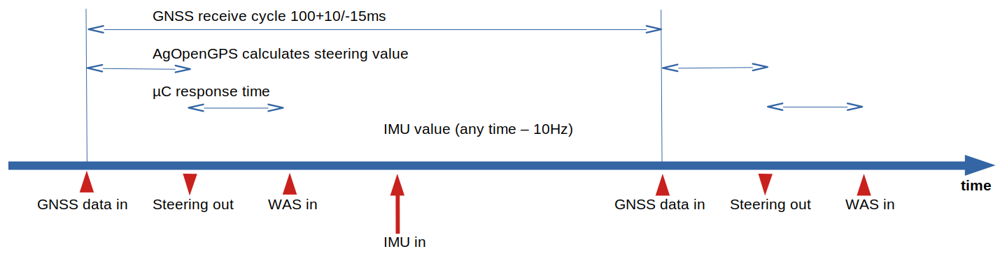
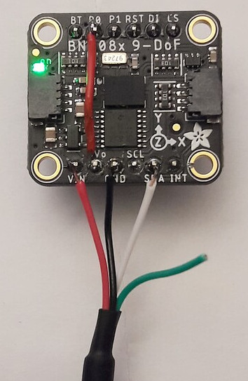
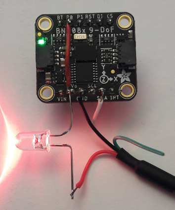

(1) µC e. g. Ardusimple Nano, Teensy4.1, ESP32,... controlling the power stage and sampling wheel angle sensor (WAS) and optionally IMU data. Also reads the switches 
(2) Power stage to drive a motor or hydraulic valves
(3) Input section: Analog-digital converter for WAS signal and decoupling for buttons
(4) Satellite navigation receiver (GNSS) with RTK precision + antenna (one or two sets)
(5) IMU unit
(6) Section and rate control (option)
(7) Power stage and analog frontend for section and rate control
All blocks but the antennas may be integrated into one PCB - see "Central Units"

### What is "AgOpenGPS"?
AgOpenGPS "AOG" is an open-source project initiated by the Canadian [Brian Tischler](https://www.astech.ca/archives/indexofpastwinners/tischler-brian). It started as parallel driving aid and mapping software for Windows(TM) and turned into a full-control system for steering including section and rate control. Today, many peaceful people from all over the world collaborate and contribute to the project. 

The communication part of the software is called AgIO, and AgDiag is the software part showing an overview about all values exchanged between software and hardware. 

On the hardware side, there are several different solutions for the same job, beginning from just plugging readily available module together to the hardware designs provided in this repo for professional prototyping production, which supports all functions of AgOpenGPS in a dedicated design. 

All code is published under the [GNU general public license V3.0](https://www.gnu.org/licenses/gpl-3.0.html) on [Github](https://github.com/farmerbriantee/AgOpenGPS).

All hardware in this repository is published under the [Cern-OpenHardwareLicense-S-2.0](https://cern-ohl.web.cern.ch/).

This text is published under the non-commercial share-alike [Creative Commons License V4](https://creativecommons.org/licenses/by-nc-sa/4.0/deed.en).

All this keeps the project open for everyone in the future. Everyone is allowed to copy and produce everything of this project, but has to open her/his mods for the community in return.

This document describes the system and the hardware. A description of the software itself comes with [the manual embedded in the AgOpenGPS software packet.]([https://github.com/farmerbriantee/AgOpenGPS/releases)

Join the [AgOpenGPS forum](https://discourse.agopengps.com/) for further help and discussions.

>### Important Functional Safety Advice
>
>Agricultural steering systems have to meet at least the agricultural performance level AgrPL d acc. UN ECE R79 (see professional systems like [this](https://www.mobil-elektronik.com/uploads/media/Prospekt_Brochure_ME_Agricultural_Vehicles_ENG.pdf))!
>
>Especially with hydraulic control, the vehicle may likely get uncontrollable on a failure of the valve-controlling electronic which may result in fatal casualties or serious injuries!
>
>For AgOpenGPS, the required safety level may be archieved by the fail-safe absense of power for the valve/motor controlling unit, meaning this function must meet the requirements of AgrPL d.
>
>**Mind, that YOU are reliable for all what you do with this project!**

----
# Basic Block Diagram

# Getting Started, Level 1: Parallel Driving Aid and Mapping

A tablet/notebook/convertable computer running Windows and an RTK-enabled GNSS (GPS) receiver is needed. Read [the posts in the forum](https://discourse.agopengps.com/search?q=which%20tablet) to find a suitable tablet. The screen and its brightness is of highest importance. Other helpful features, you may need, are GSM (mobile data) for the reception of NTRIP data for real-time correction of the GNSS data (instead of using the mobile phone), easy charging for 12V or Ethernet, if USB is not used.

The "standard" RTK GNSS receiver for AgOpenGPS is based on the [ZED-F9P module from ublox](https://www.u-blox.com/en/product/zed-f9p-module), if you don't have an onboard receiver in the tractor. Ready-to-use boards ship from [Ardusimple](https://www.ardusimple.com/product/simplertk2b/) for less than 200€ or $. This is the only option where you can start with a single antenna and migrate to dual-antenna later one. Even two Ardusimple boards are by far less expensive than dual-receivers from [Serpentrio](https://www.septentrio.com) or [Bynav](https://www.bynav.com/). There is no noteworthy difference in precision between these receivers. The Ardusimple board is the de-facto standard for AgOpenGPS. [Here](https://www.optimalsystem.de/os/docs/u-blox-gnss-konfigurationsanleitung.pdf) is a good introduction in German.

**Parts list**
- tablet/notebook/convertable computer for Windows 7 or higher
- [Ardusimple receiver with antenna](https://www.ardusimple.com/product/simplertk2b-basic-starter-kit-ip65/) or equivalent 
- USB-cable A-microB
- 12V charger for computer (optional but recommended)

**Installation:**
- Download and install [AgOpenGPS software packet]([https://github.com/farmerbriantee/AgOpenGPS/releases)
- Configure the Ardusimple with the help of the software ["ucenter"](https://www.u-blox.com/en/product/u-center) (not version 2!) and [this setup file](central_unit_2.0/code/Ardusimple_GGA_VTG_460.txt)
- connect charger - computer - GNSS-receiver - antenna in a row (the USB receptacle next to the antenna plug is the right one)
- start AgOpenGPS and configure the NTRIP server in AgIO
- put the antenna outside and see, if position data is received (should lock to RTK after a while)
- start mapping with AgOpenGPS

"NTRIP" is the data needed to make cm-precision to GNSS positioning. Precise satellite-based navigation systems do not only a time-of-flight measurement, but also a detecting of the signal phases. Therefore, your position is send to a server every 10 seconds, and you receive customized correction data once per second in return. This only works well, if the server is located quite close to you (<30 km). The availability of public NTRIP serves varies from country to country. There is also the option to run [your own server](https://discourse.agopengps.com/t/rtkbase-a-gui-for-your-own-gnss-base-station/2341/214?u=goronb). 

Generally, the precision is impressive, when considering that light needs 1 second for 300,000km, so it only takes 33 nanoseconds = 0.000000033 sec per centimeter and even the wavelength of the GPS is much higher (about 20 centimeters).

Data sent by the GNSS receiver follows the [NMEA standard](https://en.wikipedia.org/wiki/NMEA_0183). For AgOpenGPS, the number of sentences should be as low as needed, so only "GGA" for position and "VTG" for speed vector.

# Level 2: Steering
There are two possibilities for steering: Turning the wheel like the driver does or driving the hydraulic system directly. Fortunately the electrical part is about the same (two PWM signals) and only the actuator differs: Either a DC motor or a dedicated proportional valve. 
For AgOpenGPS, feedback from a wheel angle sensor "WAS" is always needed, although an incremental sensor at the DC motor would work as well. The best choice is measuring the signal of the build-in WAS, if there is one, but there are also lots of how-tos for adding an additional WAS.

There are 3 different approaches for driving a motor or valves:
- plugging together readily available boards (e. g. Arduino Nano with ADS1115, BNO085 and IBT-2/Cytron - plans are in the AgOpenGPS ZIP file)

- using a carrier board for those boards, which adds power supply and necessary components in classic "THT" technology (you have to solder all parts yourself - such boards are discussed in the forum)

- ordering one of the full-equipped board in this repository from a PCB manufacturer (only some "simple" parts have to be soldered by yourself)

Honestly, the last option is a nightmare these days, because some key parts (e. g. the automotive PWM power stage drivers) are not in stock from common distributors due to the general shortage in semiconductor industry these days (spring 2022). This means, you have to source from different suppliers and solder some SMD parts yourself, which is not easy in some cases. 

Nevertheless, this option is described in detail now:

**Parts list**
- tablet/notebook/convertable computer for Windows 7 or higher
- [one or two Ardusimple receiver with antenna](https://www.ardusimple.com/product/simplertk2b-basic-starter-kit-ip65/) or equivalent 
- IMU unit based on BNO08x
- mainboard + housing
- cables
- 12V charger for computer (the Central Unit 3.0 has a build-in charger, but no software support yet)
- steering wheel motor or hydraulic unit + support material

**Installation:**
- Download and install [AgOpenGPS software packet]([https://github.com/farmerbriantee/AgOpenGPS/releases)
- Configure the Ardusimple with the help of the software ["ucenter"](https://www.u-blox.com/en/product/u-center) (not version 2!) and [this setup file](central_unit_2.0/code/Ardusimple_GGA_VTG_460.txt)
- assemble board and put it into the housing
- prepare cables 
- connect everything
- start AgOpenGPS and configure the NTRIP server in AgIO
- put the antenna outside and see, if position data is received (should lock to RTK after a while)
- start working with AgOpenGPS

# Hints for Wiring
All signals to the motor or hydraulic valve shall be inside a single cable. This cable may only be connected to the Central Unit and the motor/valve unit - nowhere else. So no connection between the valve unit and the chassis as long as you don't want to use your equipment for short-wave broadcasting!

WAS:
If there is a dedicated WAS for AgOpenGPS, use a 3-pole calbe running from the Central Unit to the WAS. It contains the signals +5V, "WAS" = analog output of the WAS and 0V = GND. No other connections like "grounding" somewere in this case either! If a factory-assembled WAS shall be "sourced", a two-pole cable with the signals "WAS" (again the analog output of the WAS) and "WAS_N" is needed. Connect "WAS_N" to 0V next to the point where you already connected the "WAS". Select "differential" in AgOpenGPS in both cases.

There is intentionally no coupling of 0V from power stage and computer side on the Central Unit 1.x and 2.x, because the charger unit has that normally. If this is not the case (e. g. you're using an inverter and a charger with mains plug), the connection must be done manually.

# Dual-GNSS? IMU? Both?
When you living in a plain area with no hills, you can start farming now. But likely there are rolling hills around and your fields are sloping a little bit, so that the antenna position swings left and right with the slope of the field and there is a need to compensate that by either using two antennas with two RTK receivers or and an	inertial measurement unit (IMU). 
Pros of dual antenna are:
- always absolute position in the room
- antenna diversity: if one antenna does not receive the signal due to trees, the other one will take over for that time

Pros of IMU:
- Cheaper
- Roll angle is more exact
- Reduced update rate if using two Ardusimple with cross-communication (8Hz instead of 10Hz). Solution: Connect both F9P directly to the PC via USB (same setup file).
 
The z axis of the IMU must be exactly the vertical axis of the vehicle. Recommended is the use of an BNO085 or BNO080 - directly or embedded in the CMPS14 board.

# Arduino-Nano or Teensy-based?
For all 3 different approaches, these two options are available (plus ESP32 to name the third). The Teensy has more memory and is faster - both more than 100 times). The advantage today is: simply nothing, as long as you don't use CAN or main parts of AgOpenGPS run inside the iMX controller. Maybe in future, AgOpenGPS will migrate there and has just have a web page on any mobile device. This would also improve the steering behaviour noteworthy due to reduced jitter times (no Windows in between).

# IBT-2 or Cytron
First of all: None of them for driving a Danfoss block - a rail-to-rail operational amplifier will do that job as well.

Intergrated boards will always use what the IBT-2 is using, because there is no need to care for short-circuits due to miswiring or mechanical damage. The drivers have a build-in protected agains all that. And there is no need for a freewheeling relay if a steering wheel motor is used. 

When using complete boards, further arguments matter: Yes, the IBT-2 is cheaper, but there are a lot of bad-quality boards out in the wildlife. Control the solderings and always add a thermal pad between the board and the heat sink! The solder mask is no suitable isolation between the PCB and the heat sink! These qualitiy problems are avoided by buying the Cytron. But the Cytron blocks manual steering, when AgOpenGPS isn't in control, because it short the motor wires - it acts as electrical brake, which is not intended in this use-case. Any kind of disengagement is needed.

# USB or Ethernet
Many discussions have been made about the "right" interface between the computer and the peripherals. In fact: Both kind of connectors, USB and Ethernet, are not suitable for agricultural use. Professional systems use M8 and M12 connectors. The type "M12-D" is well-suitable for both Ethernet and USB, but no computer has such a connector... An option is soldering yourself, but another option is just having some spare cables in the box. 

An important point is the ability to transport supply power. For Ethernet, that makes some effort and only a few devices support PoE. USB always have that feature, so you can use just one USB-C cable for charging the computer and transfer data to the peripherals. Clear point of USB, as long as two-wire Ethernet is not commonly available for adequate costs.

My suggestion: If you ever dreamt of being a professional network admin, go for Ethernet. All others should use USB. Here, the Teensy may bring both worlds together by using RNDIS (Ethernet over USB) one day.

**Timing**

This is the basic timing of AgOpenGPS. It is defined by the GNSS update cycle, so about 100ms for the F9P (Ardusimple) board. The postion data is an average of the last period, so the position is about 50ms "old". After having received that data, AgOpenGPS calulates all the steering data and sends it to the µC unit, that delivers the position of the steering (from wheel angle sensor) and optionally the IMU data in return. This is obviously not the best time, because that data is about 90ms old when processed by AgOpenGPS.

Using an extra µC for the IMU ("IMU_USB_v5_0.ino") even makes the timing even worse, because data receives at *any* time, so we don't have a delay but a fully unpredictable jitter. One workaround will come the AgOpenGPS V6 - there will be a unit that combines GNSS and IMU data into one non-standard NMEA sentence.

The best timing is archieved with no additional µC at all for GNSS and IMU. Both units are able to send serial data directly to the PC. All you need for the GNSS receivers is a USB cable and an USB-serial-converter cable for the IMU. The jitter simply can't be less.

Connection [of USB-Serial-Cable](https://de.aliexpress.com/item/32965292523.html) to BNO085 in RVC mode: 1st pic shows USB cable supplying board with 5V, if there is a voltage regulator on it; 2nd pic shows the same cable w/o using the voltage regulator. The 1st is prefered for this Adafruit board, the 2nd is for all boards w/o voltage regulator like shown in the 3rd picture. Supply voltage is about 3.05V in that case :+1:

For those who prefer Ethernet connections: This is how to connect two Ardusimple to AgIO via an Ethernet cable. [This module can connect two serial devices](https://www.pusr.com/products/dual-UART-to-ethernet-module-usr-tcp232-e2.html), in this case two [Ardusimples @ 460800Bd](https://github.com/GormR/HW_for_AgOpenGPS/tree/main/central_unit_2.0/code) to Windows. 

Will also work for one Ardusimple and one BNO085 in RVC mode.

The red wire is the +5V supply - FIVE volt supply.

black: 0V
red: 5V
brown: 3.3V
green: to Ardusimple (NTRIP; RxD@AS, TxD@USR)
white: from Ardusimple (NMEA data; TxD@AS, RxD@USR)

(same colors used as above for the BNO085)

The connection to the Ardusimple board can also be made by [the plugable Pixhawk connectors using 0V, 5V and the two communication lines.](https://www.ardusimple.com/simplertk2b-hookup-guide/) In that case, connecting the 3.3V line is not needed, but I would put a 100 Ohms resistor in series with the com lines.

[Here](central_unit_2.0/code/) is is a replacement for the standard AgIO.exe. Just replace it by this file and work with the data directly.

----
# Projects within the repository

All projects use a robust housing and industrial M12/M8 connetors (optional) as far as possible. There is also an option to use industrial PushIn connectors instead.

The PCB project was set up with the EDA program „EasyEDA“, which is freely usable. 

*These products are still working perfectly with AgOpenGPS, but not recommended for new systems*

[Documentation Central Unit](central_unit/README.md)

[Documentation Rooftop Unit](rooftop_unit/README.md)

[Documentation Ethernet Adapter for UDP](ethernet_adapter/README.md)

**Main boards**

Update of Central Unit 1.x with 2nd slot for dual-Ardusimple:

[Documentation Central Unit 2.x](central_unit_2.0/README.md)

There is a [reduced BOM](central_unit_2.0/production_data/BOM_CentralUnit2.3_(USB-recommended).csv) for USB (estimated board price @ JLCPCB: $30 after the semiconductor prices will have returned to normal levels again).

Teensy-based central unit with additonal support for USB-PD hardware (no firmware support yet):

[Documentation Central Unit 3.x](central_unit_3.0_Teensy/README.md)

(This board also has a slot for Bynav-GNSS-receivers)

# Order How-To JLCPCB
- browse to [JLCPCB](https://jlcpcb.com) and click "Quote now"
- upload Gerber file (either for [Centrol unit](central_unit/production_data/Gerber_Central_Unit_AgOpenGPS.zip) or [Rooftop Unit](rooftop_unit/production_data/Gerber_Rooftop_Unit_AgOpenGPS.zip)). The Gerber of the central unit is too big for a preview, so you also have to enter the DIMENSIONS in the next line after the upload process has fully finished: 150 x 92mm²
- enter the number of PCBs to order: 5, 10, 15, etc
- if you like, you may change the color of the solder mask printing. But not all colors are available for SMD manufacturing!
- for the central unit check switch "SMT assembly" and "Assemble top layer"
- Accept terms and click "NEXT" (you may log in now)
- Upload [BOM](central_unit/production_data/BOM_Central%20Unit%20for%20AgOpenGPS.csv) and [Pick and Place file](central_unit/production_data/PickAndPlace_Central_Unit_AgOpenGPS.csv)
- click NEXT
- browse through the list and see, what is not confirmed. For some you may find 2nd sources, some maybe not available from stock in that moment, some like the Nexperia controller are unavailable and some like connectors are not supported yet (see my [video](https://www.youtube.com/watch?v=dLczChhmDCY) how to solder the USB-C receptacle; soldering the USB-C receptacle like this is only necessary, if you want to use a single USB cable for charging and data. USB itself is also connectable via a dedicated PushIn connector)
- click NEXT
- check if all components are placed correctly (e. g. rotation information is sometimes incorrect in the libraries)
- order

# (German copy)

(1) µC, also z. B. Ardusimple Nano, Teensy4.1, ESP32,... steuert die Leistungsendstufe und liest die Werte des Lenkwinkelsensors (LWS = WAS), der Schalter und ggf. der IMU ein
(2) Leistungsendstufe, um den Motor oder die Hydraulik zu bedienen
(3) Eingänge: Analog-digital-Wandler für das LWS-Signal und Eingangsstufe für die Schalter
(4) GPS-Empfänger (GNSS) mit RTK-Genauigkeit + Antenna (ein oder zwei Paare)
(5) IMU-Einheit
(6) Teilbreiten- und Volumensteuerung (optional)
(7) Leistungsendstufe und Analogteil der Teilbreiten- und Volumensteuerung
Alle Blöcke bis auf die Antennen können sich in einem Gehäuse befinden, z. B. auf den Leiterplatten in diesem Repository

### Was ist "AgOpenGPS"?
AgOpenGPS "AOG" ist ein open-source-Project, das vom kandischen Farmer [Brian Tischler](https://www.astech.ca/archives/indexofpastwinners/tischler-brian) initiiert wurde. Es war zunächst eine reine Parallelfahrhilfe und wurde nach und nach mit Hilfe der Community zu einem Lenksystem mit Teilbreitensteuerung. Die Software läuft nur unter Windows(TM) - es wird also ein Windows-Tablet oder Notebook benötigt. Inzwischen arbeiten Interessierte aus aller Welt friedlich an der Weiterentwicklung des Projektes. 

Die Software ist ein Set aus drei Programmen: Der Kommunikationsteil heißt AgIO, und AgDiag ist eine Anzeige aller Zustände und ausgetauschten Daten. 

Hardwareseitig gibt es vielfältige Ansätze für dieselbe Aufgabe. Das reicht von Anleitungen, wie man Arduino-Module mit Sensor- und Aktorboards zusammensteckt über Trägerplatinen, auf die man diese Module auflötet bis hin zu den in diesem Repository hinterlegten Modulen, die man als Fertigplatine bei einen Leiterplattenbestücker in Auftrag geben kann und die alle Funktionen von AgOpenGPS in einer Einheit unterstützen.

Die gesamte Software ist unter der  [GNU general public license V3.0](https://www.gnu.org/licenses/gpl-3.0.html) auf [Github](https://github.com/farmerbriantee/AgOpenGPS) veröffentlicht.

Alle Hardwareprojekte in diesem Repository sind unter der [Cern-OpenHardwareLicense-S-2.0](https://cern-ohl.web.cern.ch/) veröffentlicht.

Diese Beschreibung steht unter der nichtkommerziellen [Creative Commons License V4](https://creativecommons.org/licenses/by-nc-sa/4.0/deed.de).

Dadurch wird sichergestellt, dass das Projekt jetzt und in Zukunft allen zugänglich ist und alle Weiterentwicklungen der Community wieder zu Gute kommen.

Dieses Dokument beschreibt das System und die Hardsware. Eine Softwarebeschreibung befindet sich in einem [PDF, das sich im ZIP zusammen mit der Software befindet.]([https://github.com/farmerbriantee/AgOpenGPS/releases)

Es gibt ein (englisches) [AgOpenGPS forum](https://discourse.agopengps.com/), wo viele Leute unterschiedlichste Anwendungsfälle diskutieren.

>### Wichtiger Hinweis zur Funktionalen Sicherheit
>
>Fest verbaute Lenksystem, die z. B. in die Hydraulik eingreifen, müssen den Agricultural performance level AgrPL d nach UN ECE R79 (siehe z. B. professionelle Systeme wie [dieses](https://www.mobil-elektronik.com/uploads/media/Prospekt_Brochure_ME_Agrarfahrzeuge_DEU.pdf)) erfüllen!
>
>Im Falle eines Ausfalls und dadurch ausgelösten Lenkbewegungen kann es zu tödlichen Unfällen oder schweren Verletzungen kommen!
>
>Mit AgOpenGPS kann der notwendige Sicherheitslevel durch die fehlersichere Abschaltung der elektrischen Leistung für die Lenkaktoren erfolgen. Diese Abschaltung muss mindestens diesen Sicherheitslevel erfüllen.
>
>Alle Daten diese Repositories stehen unter der CERN Open-Hardware-Lizenz 2.0. Jede Haftung für Personenschäden und Sachschäden auf Grund Fehlern der Beschreibung oder Fehlern der Leiterplatte oder Software wird ausgeschlossen! 
>
>**Du bist dafür verantwortlich, was du mit diesem Projekt machst!**

----
# Grundlegendes Blockdiagram

# Getting Started, Level 1: Parallelfahrhilfe und Dokumentation

Für den Einstieg wird ein Tablet, Notebook oder Convertable mit dem Betriebssytem Windows une ein RTK-fähiger GNSS-(GPS)-Empfänger benötigt. Eine Beratung zum Rechner gibt es [in diesen Posts im Forum](https://discourse.agopengps.com/search?q=which%20tablet). Das ist natürlich immer nur eine Momentaufnahme. Wichtig ist in jedem Fall eine hohe Bildschirmhelligkeit. Weitere wichtige Punkte sind neben der Gesamtperformance die Möglichkeit, mobile Daten zu empfangen (eingebautes GSM-Modem), falls kein Handy dafür verwendet werden soll, um die NTRIP-Daten für die Positionskorrektur zu empfangen, eine einfache Lademöglichkeit für 12V und Ethernet, falls man USB nicht verwenden möchte.

Die Mehrzahl der RTK-GNSS-Empfänger für AgOpenGPS basieren auf einem [ZED-F9P-Module von ublox](https://www.u-blox.com/en/product/zed-f9p-module), aber auch bereits vorhandene Systeme der Traktorhersteller können verwendet werden. Fertige Empfängerplatinen gibt es z. B. bei [Ardusimple](https://www.ardusimple.com/product/simplertk2b/) für weniger als 200€. Das ist auch die einzige Möglichkeit, zunächst mit einem Ein-Antennen-System zu starten und später auf zwei Antennen aufzurüsten. Dabei sind zwei Ardusimples + zwei Antennen immer noch deutlich günstiger als Dual-Receiver von  [Serpentrio](https://www.septentrio.com) oder [Bynav](https://www.bynav.com/). Nennenswerte Genauigkeitsunterschiede haben die Systeme nicht. Das  Ardusimple-Board ist deshalb nicht umsonst der de-facto-Standard bei AgOpenGPS. 

[Hier](https://www.optimalsystem.de/os/docs/u-blox-gnss-konfigurationsanleitung.pdf) gibt es eine guten Anleitung zur Konfiguration.

**Einkaufsliste**
- Tablet/Notebook/Convertable-Computer mit Windows 7 oder höher
- [Ardusimple-Empfänger mit Antenne](https://www.ardusimple.com/product/simplertk2b-basic-starter-kit-ip65/) oder vergleichbarer Empfänger 
- USB-Kable A-microB
- 12V-Ladegerät für den Computer (optional aber empfehlenswert)

**Installation:**
- [AgOpenGPS software packet]([https://github.com/farmerbriantee/AgOpenGPS/releases) downloaden und installieren 
- Ardusimple konfigurieren mit der Software ["ucenter"](https://www.u-blox.com/en/product/u-center) (nicht die Version 2 benutzen!) und [diesen Setup-Daten](central_unit_2.0/code/Ardusimple_GGA_VTG_460.txt)
- Ladegerät, Computer - GNSS-Empfänger und Antenne einer einer Reihe verbinden (die USB-Buchse neben dem Antennenstecker ist die richtige)
- AgOpenGPS starten und den NTRIP-Server in AgIO konfigurieren (in D sollten im Allgemeinen die Daten von Sapos verwendet werden)
- Antenne nach draußen stellen und warten, bis Positionsdaten angezeigt werden. Nach einer Zeit sollte auch "RKT" angezeigt werden.
- Aufs Feld fahren und loslegen

Mit "NTRIP" werden Korrekturdaten bezeichnet, die benötigt werden, um eine Genauigkeit im cm-Bereicht zu erreichen. Dazu muss der Empfänger nicht nur die Signallaufzeit zwischen den Satelliten und der Antenne messen, sondern auch die Phase des Empfangssignals. Die notwendigen Korrekturdaten liefert ein NTRIP-Server, der über eine Referenzantenne verfügt, dessen Position hochgenau bekannt ist und sich in der Nähe befinden muss (< 30km). Man kann einen solchen Server auch [selbst](https://discourse.agopengps.com/t/rtkbase-a-gui-for-your-own-gnss-base-station/2341/214?u=goronb) betreiben, allerdings gibt es im deutschsprachigen Raum kostengünstige, professionelle Angebote wie z. B. SAPOS speziell for Landwirtschaft und Vermessung.

Folgende Daten werden für SAPOS benötigt:
- Server-IP (hier am Beispiel Nordrhein-Westfalen: www.sapos-nw-ntrip.de (AgIO kann damit automatisch die IP (hier: 80.158.61.104) und den Port (hier: 2101) ermitteln
- Benutzerkennung in der Form "nw-123456"
- Passwort in der Form "abcdef"

Insgesamt ist die erreichbare Genauigkeit beeindruckend, wenn man bedenkt, dass Licht und damit auch Funkwellen 300.000km in einer Sekunde zurücklegen, man also nur 33 Nanosekunden für einen cm benötigt und selbst die Wellenlänge der Trägerfrequenz mit ungefähr 20cm deutlich größer ist.

Ein GNSS-Empfänger sendet die Daten im [NMEA-Format](https://de.wikipedia.org/wiki/NMEA_0183). Die Einstellungen sollten so sein, dass möglichst nur die notwendigen Sätze "GGA" für Position und "VTG" für den Geschwindigkeitsvektor gesendet werden (s. u.).

# Level 2: Automatische Steuerung
Es gibt zwei grundsätzlich verschiedene Möglichkeiten der Steuerung: Direkt über Hydraulikventile oder mit Hilfe eines Elektromotors am Lenkrad drehen. Einen Eingriff in die Hydraulik sollten nur diejenigen vornehmen, die wirklich verstanden haben, was AgPL d bedeutet und es umsetzen können. Auch wenn es natürlich das eleganteste ist... Zu unterscheiden sind hier Systeme, die aus zwei Ventilgruppen bestehen (Steuerventil und Umschaltventil zwischen Lenkrad und AgOpenGPS-Steuerventil) und "intelligenten" Ventilinseln, wie z. B. "Danfoss".

Bei Lenkradmotoren hat sich der Phidgets-Motor als meistverwendeter herausgestellt, obwohl natürlich auch vergleichbare Motoren funktionieren. Zu unterscheiden sind Ankopplungen über ein Reibrad und Zahnradlösungen, bei denen das Ritzel des Motors in ein Zahnrad eingreift, das am Lenkrad festgeschraubt ist. Beide Lösungen haben sicherlich ihre Vorteile - wichtig ist, dass der Fahrer jederzeit ins Lenkgeschehen eingreifen kann! 

Motor oder Hydraulik: Zum Glück sind die Ansteuersignale dieselben: 2 PWM-Leistungssignale. Für das Umschaltventil muss bei Hydraulik zusätzlich noch ein Enable-Signal entsprechender Leistung bereitgestellt werden. "Danfoss"-Ventile können ebenfalls über 2 PWM angesteuert werden, es reicht allerdings ein einfacher Operationsverstärker als "Leistungsendstufe".

AgOpenGPS benötigt immer einen Lenkwinkelsensor, obwohl technisch auch eine Regelung über einen Tachogeber am Motor möglich wäre. Aber zum Glück haben ja viele Traktoren bereits eingebaute Sensoren, und es gibt auch sehr gute Anleitungen, einen Sensor einzubauen.

Für die Steuerung gibt es nun drei verschiedene Ansätze:
- man kauft sich fertige Teilmodule (Arduino Nano, ADS1115, ...) und verdrahtet diese "fliegend" in einem geeigneten Gehäuse

- man lässt sich eine fertige Leiterplatte herstellen, die für ein paar Euro aus China angeflogen kommt. Die Bestückung mit "klassischen" THT-Bauteilen muss man dann selber durchführen und auch die o. g. Teilmodule hier wieder auflöten

- man bestellt sich eine der vollständig bestückten Leiterplatten aus diesem Repository. Dann müssen nur noch die gewünschten Stecker angelötet werden.

In jedem Fall muss natürlich die Software auf den µC aufgespielt werden. Eine Beschreibung dazu befindet sich bei den einzelnen Leiterplatten.

Aus aktuellem Anlass muss aber leider gesagt werden, dass die letztgenannte Möglichkeit aktuell (Frühjahr 2022) sehr mühselig ist, da Schlüsselbauteile wie µC und Leistungstreiber nicht ab Lager verfügbar sind und somit anderweitig beschafft und selbst aufgelötet werden müssen. Leider kein Spaß für viele und erst einmal keine Besserung in Sicht

**Einkaufsliste**
- Tablet/Notebook/Convertable-Computer für Windows 7 oder höher
- [ein oder zwei Ardusimple-Empfänger mit Antenne](https://www.ardusimple.com/product/simplertk2b-basic-starter-kit-ip65/) oder vergleichbarer Empfänger
- IMU auf Basis eines BNO080 oder BNO085 (auch als CMPS14-Board möglich)
- eines der Mainboard aus dem Repository hier + Gehäuse
- Kabel
- ein 12V-Ladegerät für den Computer (die Central Unit 3.0 hat ein eingebautes USB-C-PD Ladegerät, aber bisher keinen passenden Treiber)
- Lenkradmotor oder Hydraulikeinheit und Zubehör dafür

**Installation:**
- [AgOpenGPS software packet]([https://github.com/farmerbriantee/AgOpenGPS/releases) downloaden und installieren
- Ardusimple konfigurieren mit der Software ["ucenter"](https://www.u-blox.com/en/product/u-center) (nicht die Version 2 benutzen!) und [diesen Setup-Daten](central_unit_2.0/code/Ardusimple_GGA_VTG_460.txt)
- Mainboard mit Steckern bestücken und programmieren; Ardusimple-Boards aufstecken, wenn sie mit im Gehäuse sein sollen
- Kabel vorbereiten
- Alles verbinden
- AgOpenGPS starten und den NTRIP-Server in AgIO konfigurieren mit den eigenen Zugangsdaten (Sapos z. B.)
- Antenne im Freien aufstellen. Nach einer Zeit sollte der eigene Standort angezeigt werden und auch die Anzeige "RTK" erscheinen
- Los auf's Feld und AgOpenGPS ausprobieren

# Dual-GNSS? IMU? Oder beides?
Landwirte in im nördwestlichen Niedersachsen können jetzt loslegen. Alle anderen haben wahrscheinlich das ein oder andere Feld in Hanglage, und da läuft dann die eigene Position mit der Hangneigung weg, weil der Fußpunkt der Antenne zur Seite wandert. Also muss das kompensiert werden, wozu es eben diese beiden Möglichkeiten gibt: Eine zweite RTK-Empfänger/Antennenkombination oder eine IMU (inertial measurement unit - Inertiale Messeinheit, also ein Sensor, der die relative Lage im Raum an Hand der Schwerkraft und Massenträgheit bestimmen kann).

Vorteile Dual-GNSS:
- hat immer die absolute Position im Raum
- "Antenna-Diversity": Der kurzzeitige Ausfall einer Antenne führt nicht zum Verlust der Genauigkeit, z. B. wenn eine Seite von einem Baum abgeschattet wird

Vorteile IMU:
- Kostengünstiger
- Genauere Winkelerfassung
- Wenn zwei Ardusimple mit Querkommunikation betrieben werden (z. B. an einem ESP32), verringert sich die Datenrate der Position von 10 auf 8 pro Sekunde. Das kann aber umgangen werden, indem beide Boards direkt über USB mit dem PC verbunden werden (sie haben dann auch das gleiche Setup-File (s. o.).
 
Die z-Achse der IMU muss vertikal montiert sein. Es sollten BNO085 or BNO080-basierte Sensoren verwendet werden - allein oder als CMPS14-Board.

# Hinweise zur Verkabelung
Alle Signale, die zum Motor oder zur Ventilinsel führen, sollten in einem Kabel enthalten sein. Das Kabel darf nur an der Central Unit und am Motor oder an der Ventilinsel angeschlossen sein, sonst nirgendwo, also auch nicht die 0V an der Ventilinsel mit der Karosserie verbinden! Man baut sich so ganz schnell eine Rahmenantenne für Mittelwelle...

LWS/WAS:
Soll ein Extra-Lenkwinkelsensor verwendet werden, sollte ein 3pol. Kabel von der Central Unit zum Sensor verlegt werden, das die Signale +5V, "WAS" = Analogwert des LWS und 0V = GND enthält. Auch hier sollte nichts anderes angeschlossen sein, als der LWS, also auch wieder eine "Erdung" zur Karrosserie oder so. Wenn ein bereits verbauter LWS "angezapft" werden soll, muss die Verdrahtung über ein zweipoliges Kabel "differenziell" erfolgen: "WAS" ist wieder der Analogwert des LWS, und "WAS_N" wird an einen 0V-Punkt in der Nähe des Punktes angeschlossen, wo auch "WAS" angeklemmt ist. Bei Verwendung der Central Units sollte in beiden Fällen in AgOpenGPS "differenziell" ausgewählt werden.

Bei der Central Unit 1.x und 2.x gibt es ganz bewusst keine harte Kopplung von 0V/GND der Leistungsendstufe und 0V/GND des USB, weil dies normalerweise über das 12V-Ladegerät erfolgt und eine Masseschleife vermieden werden soll. Sollte dies Verbindung nicht vorhanden sein, weil z. B. ein 230V-Netzteil an einem Wechselrichter betrieben wird, muss diese Verbindung manuell hergestellt werden.

# Arduino-Nano oder Teensy?
Für alle drei Möglichkeiten (Module zusammenlöten, auf Trägerplatine löten oder integriertes Board) gibt es zwei zur Auswahl stehende µC: der "klassische" Arduion-Nano-Controller ATMEGA368 oder das Teensy4.1-Board mit iMX1061-Controller von NXP. Der ESP32 und andere mal außen vor - sie haben ihre Daseinsbereichtigung z. B. für WLAN-Lösungen. Der Teensy ist mehr als 100x schneller, hat mehr als 100x mehr Speicher und hat somit - nein, bisher leider garkeinen Vorteil, solange AgOpenGPS weder CAN unterstützt oder wesentliche Softwareteile wirklich im iMX laufen und eine mobile Webside bereitstellen. Wäre super, weil sicherlich auch die Lenkqualität besser würde, ist aber noch Zukunftsmusik.

# IBT-2 oder Cytron
Vorweg: Für Danfoss reicht ein einfacher Operationsverstärker. Für alles andere muss schwereres Geschütz aufgefahren werden.

Die intergraten Board in diesem Repository werden immer die robusten, speziell für die Automobilindustrie entwickelten Infineon-Treiber verwenden, die auch auf dem IBT-2 verbaut sind, weil diese einfach vollständig gegen alle möglichen Fehler und Überlastung vollständig geschützt sind. Außerdem benötigt man nicht unbedingt einen Freilauf für das Lenkrad, weil der Motor nicht nennenswert elektromotorisch gebremst wird.

Wenn man eine Baugruppe fertig zukaufen möchte, kommen noch andere Argumente ins Spiel: Ja, ein IBT-2 ist günstiger, aber zumindeste die billigen China-Clones sind oft von wirklich lausiger Qualität. Hier muss man sich auf jeden Fall die Arbeit machen und den Kühlkörper abschrauben und mit Wärmeleitpaste oder besser einem Wärmeleitpad gegen die Leiterplatte isolieren. Der Lötstopplack alleine ist dafür vollkommen ungeeignet. Das hat zu einem schlechten Ruf dieser Lösung begetragen, ist aber - wie gesagt - auch leicht zu beheben.

Kauft man ein Cytron-Board, bekommt man immer gleich gute Qualität. Allerdings schließt ein Cytron die Motorwicklungen kurz, wenn AgOpenGPS nicht steuert. Dadurch ist es nicht mehr möglich das Lenkrad vernünftig leicht zu drehen. Ein Freilauf wird also auf jeden Fall benötigt.

# USB oder Ethernet
Unzählige Diskussionen gibt es, welches die beste Schnittstelle zwischen AgOpenGPS und der Hardware ist. Die ehrliche Antwort ist zunächst einmal: Sowohl USB als auch Ethernet haben für automobile/landwirtschaftliche Verwendung ungeeignete Stecker. Beide lassen sich allerdings mit den in professionellen Geräten verwendeten M12-D-Stecker versehen und sind dann sogar wasserfest bis IP67. Computer mit einem solchen Stecker sucht man allerdings vergeblich. Selbstlöten ist natürlich möglich oder nimmt Kabel von der Stange und legt sich ein paar als Ersatz ins Handschuhfach.

Ein wichtiger Punkt ist, dass der Anschluss auch den Versorgungsstrom liefern kann. Klarer Vorteil für USB - hier kann sogar der Computer während der Fahrt aufgeladen werden (Treiber vorausgesetzt - siehe oben). Der Vorteil mag sich zukünftig relativieren, wenn automobiles Zweidraht-Ethernet üblicher wird (Single-Pair Ethernet) und ICs zu vertretbaren Kosten für die AgOpenGPS-Gemeinde verfügbar werden.

Meine Meinung: Wer immer schon ein professioneller Netzwerk-Admin werden wollte, nimmt Ethernet. Alle anderen sind mit USB weit besser bedient, zumal man über USB auch das Netzwerkprotokoll fahren kann ("RNDIS").

**Timing**

Das Bild zeigt einen Zyklus von AgOpenGPS. Bestimmt wird das Timing vom Update-Zyklus des RTK-Empfängers, also ungefähr 100ms beim F9P, der auf dem Ardusimple-Board verbaut ist. Die gesendeten Positionsdaten sind also eine Mittelung über die letzten 100ms (ms = Millisekunden) und somit beim Empfang bereits 50ms "alt". Nachdem die Daten im Computer angekommen sind, berechnet AgOpenGPS die neuen Lenkvorgaben, sendet diese und bekommt als Antwort den Wert des Lenkwinkelsensors und die Daten der IMU, falls diese mit der Central Unit verbaut sind. Das ist ziemlich suboptimal, weil diese Daten dann schon mindestens 90ms alt sind, wenn AgOpenGPS mit den Positionsdaten verrechnet.

Also ein Arduino-Nano, Software drauf ("IMU_USB_v5_0.ino") und IMU dran. Leider nein, denn nun werden die Daten zwar alle 100ms gesendet, aber völlig asynchron zu den GNSS-Daten. Das wurde erkannt und "PANDA", ein proprieterer NMEA-Datensatz erschaffen, der GNSS-Daten und IMU-Daten zusammenfasst und an AgIO sendet.

Viel einfacher ist es allerdings, einen BNO080 oder BNO085 im "RVC"-Mode zu betreiben und direkt an den PC anzuschließen. Da ist nix dazwischen und daher die Lösung, die prinzipbedingt den geringsten Jitter aufweist. Dazu wird einfach ein [USB-TTL-Seriell-Kabel wie dieses](https://de.aliexpress.com/item/32965292523.html) an die IMU angelötet: Das erste Bild zeigt ein Board mit Spannungsregler, das mit 5V versorgt wird; das zweite Bild zeigt dasselbe Bord, aber mit Umgehung des Spannungsreglers - die Spannung beträgt dann 3.05V :+1:, und auf dem dritten Bild ist ein Board ohne integrierten Spannungsregler gezeigt. Ist ein Spannungsregler vorhanden, sollte die erste Lösung verwendet werden.

Für die Freunde des Ethernets: So kann man zwei two Ardusimple oder natürlich auch einen Ardusimple und die IMU mit AgIO über ein Ethernetkabel anschließen. Gezeigt ist hier [dieses Modul](https://www.pusr.com/products/dual-UART-to-ethernet-module-usr-tcp232-e2.html), hier mit zwei [Ardusimples @ 460800Bd](https://github.com/GormR/HW_for_AgOpenGPS/tree/main/central_unit_2.0/code). 

Der rote Draht ist der der +5V-Versorgung - in Worten: fünf Volt!

Schwarz: 0V
rot: 5V
braun: 3.3V
grün: zum Ardusimple (NTRIP; RxD@AS, TxD@USR)
weiss: vom Ardusimple (NMEA data; TxD@AS, RxD@USR)

(Es wurden dieselben Farben verwendet, wie beim Beispiel des BNO08x am USB-Kabel)

Alternativ zu einer Lötverbindung kann die Verbindung auch steckbar über die [Pixhawk Stecker unter Verwendung von 0V, 5V und den beiden RX- und TX-Drähten erfolgen.](https://www.ardusimple.com/simplertk2b-hookup-guide/) Eine Versorgung mit 3,3V ist in diesem Fall nicht notwendig, aber ich würde sicherheitshalber je einen 100Ohm-Widerstand in Serie zum Signal einlöten.

[Hier](central_unit_2.0/code/) kann man die AgIO.exe mit direktem USB-Support für IMU und F9P/Ardusimple herunterladen. Einfach die Originaldatei damit ersetzen.

----
# Projekte in diesem Repository

Alle Projekte wurde in einem robusten Aluminiumgehäuse weitgehend mit industriellen M12/M8-Steckerverbindern realisiert. Es gibt aber auch die Möglichkeit, alternativ industrielle PushIn-Steckverbinder zu verwenden.

Alle Leiterplatten wurden mit dem kostenfreien Layoutprogramm „EasyEDA“ erstellt und lassen sich so direkt online bearbeiten. 

*Folgende Projekte funktionieren zwar ohne Einschränkung an AgOpenGPS, haben aber inzwischen verbesserte Nachfolger:*

[Dokumentation Central Unit](central_unit/README.md)

[Dokumentation Rooftop Unit](rooftop_unit/README.md)

[Dokumentation Ethernet Adapter for UDP](ethernet_adapter/README.md)

**Mainboards**

Update der Central Unit 1.x mit einem zweiten Steckplatz für dual-Ardusimple-Lösungen:

[Documentation Central Unit 2.x](central_unit_2.0/README.md)

Es gibt eine [reduzierte Bauteilliste](central_unit_2.0/production_data/BOM_CentralUnit2.3_(USB-recommended).csv) für die meistverwendete USB-Variante, die für ca. 30€ herzustellen ist, wenn sich die Bauteilpreise denn mal wieder in normalen Höhen bewegen werden (Schätzpreis bei einer Bestellung von 5 Stück). 

Teensy-basierte Central Unit mit Unterstützung von USB-PD (Laden des Computers über USB-C; leider noch kein Firmware-Support bisher):

[Dokumentation Central Unit 3.x](central_unit_3.0_Teensy/README.md)

(Dieses Board hat auch einen Steckplatz für den alternativen Bynav-GNSS-Empfänger)

# Bestellhinweise
1. SMD-bestückte Leiterplatte bestellen, z. B. beim JLCPCB für ca. 35€ wie oben im englischen Teil beschrieben. Deutschsprachige Alternativen: PCB-Pool, Aisler. Vorsicht bei JLCPCB: Es werden nur die Bauteile bestückt, die zum Bestellzeitpunkt verfügbar sind (wird aber deutlich angezeigt - Liste kann auch heruntergeladen werden).
2. Je nach gewünschter Verkabelungsvariante entweder M8 + M12-Steckverbinder und Kabel bestellen oder PushIn-Buchsen und Stecker und ein passendes Gehäuse
3. Gewünschte Zusatzmodule bestellen, z. B. Lagesensor CMPS14 als (verbesserte) Alternative zum Onboard-Lagesensor MMA8452, zweiter RTK-Empfänger, ESP32 für CAN oder Dual-RTK, hier ebenfalls beschriebene Dacheinheit, RS232-Schnittstellenwandler, etc
4. Kleinkram wie Schrauben, (USB-) Kabel, Kunststoffabstandshülsen etc bestellen

Selbst gelötet werden die Steckverbinder wie unter 2. beschrieben (einfache zu löten). 

Weitere Hinweise finden sich zum Teil bei den einzelnen Baugruppen.
