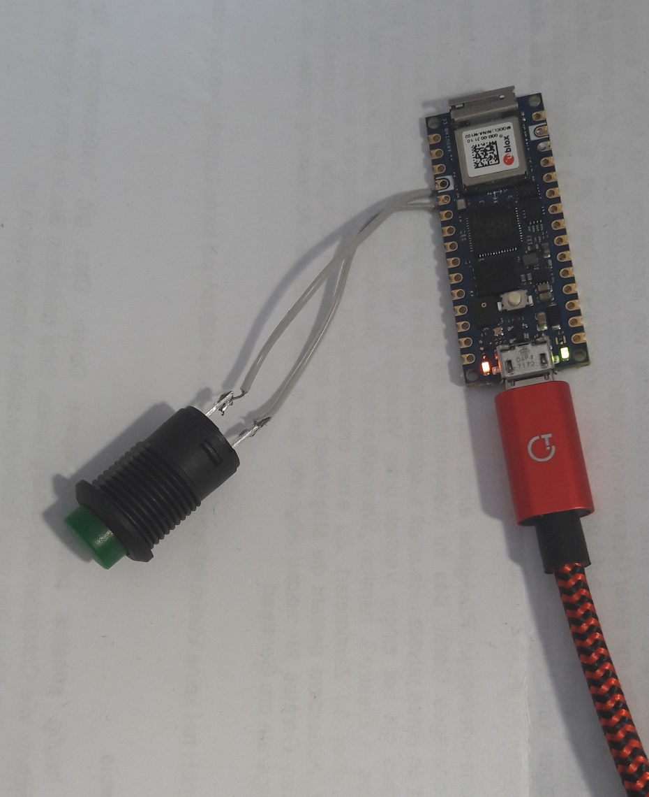

### Using an Arduino Nano RP2040 Connect as IMU for AgOpenGPS
instead of using an BNO085 or CMPS14

**Setup steps:**
1. connect Arduino to PC and [load](https://docs.arduino.cc/tutorials/nano-rp2040-connect/rp2040-python-api) MicroPython runtime to the board
2. Copy the File "main.py" from this folder to the board
3. Solder a toggle switch to the pins D2 and GND (see picture)

**Calibration:**
1. solidly mount the sensor with the PCB alligned to any axis of your traktor (+/-10°)
2. drive to a plain place (this is the calibration for roll)
3. switch the switch to "on" (the yellow LED starts blinking)
4. drive to a place where the front of the tractor is up more than 20° degrees
5. switch the switch off again - LEDs lights continuously now
**You need to replace the original AgIO.exe with the one in this Git folder (one level above), because the Arduino simulates an BNO085 in RVC mode, which is not supported by AgIO yet**

**Quick calibration of rotation only**
After a time, the heading might slightly start to drift. In that case, just switch on and off in a situation when you're not driving

Please leave a feedback in the forum.

PS:
Please forget all, what you've done the the Arduino IDE before - the board is just like an USB stick. The Python script itself may be edited by any text editor. Thonny or any other Python IDE makes it more comfortable.

### Arduino Nano RP2040 Connect als IMU für AgOpenGPS
anstatt eines BNO085 oder CMPS14

**Setup:**
1. Arduino an den PC anstöpseln und die MicroPython-Runtime [draufkopieren](https://docs.arduino.cc/tutorials/nano-rp2040-connect/rp2040-python-api)
2. File "main.py" aus diesem Verzeichnis draufkopieren
3. Einen Schalter an die Pins D2 und GND anlöten (siehe Bild oben)

**Kalibrierung:**
1. Arduino in einem robusten Gehäuse so auf dem Fahrzeug befestigen, dass irgendeine Achse der Leiterplatte mit der Fahrzeugachse übereinstimmt (+/-10°)
2. Auf eine ebene Fläche fahren, um die Seitenneigung zu kalibrieren
3. Schalter einschalten - die gelbe LED beginnt zu blinken
4. Auf eine Rampe fahren, so dass die Fahrzeugspitze nach oben zeigt (> 20°)
5. Schalter wieder ausschalten - die LED leuchtet jetzt dauerhaft, und der Sensor hat gelernt, wo vorne ist
**Die originale AgIO.exe muss durch die aus diesem Git ersetzt werden (eine Verzeichnisebene höher), weil der Arduino einen BNO085 im RVC-Modus emuliert. Das wird leider bisher noch nicht direkt unterstützt.**

**Schnellkalibrierung der Rotation**
Nach einer Zeit beginnt das Heading, leicht zu driften. In dem Fall kurz anhalten und den Schalter ein- und gleich wieder ausschalten.

Gerne ein Feedback im Forum hinterlassen!

PS:
Die Programmierung ist viel einfacher als mit der Arduino-IDE. Das board bindet sich als USB-Stick ein. Das Python-Script selbst kann mit jedem Texteditor modifiziert werden. Leichter geht es z. B. mit Thonny oder irgendeiner anderen Python-IDE.

