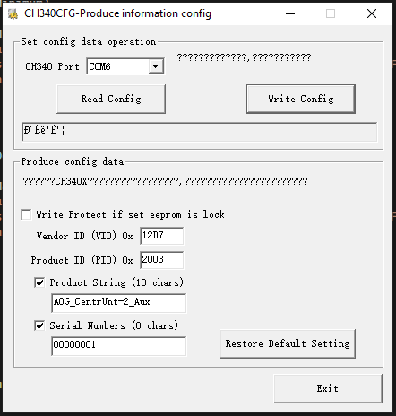

(1)  run [virtual COM port chip setup](CH340CFG.zip) and set values acc. to the pictures - take care to choose the correct COM ports for ESP32 ("-ESP"), Atmel/Nano ("-Atm") and external devices ("-Aux")

    

(2)  follow [these instructions to disable hash checking for driver installation](https://www.maketecheasier.com/install-unsigned-drivers-windows10/) 

(3)  install [driver for AgOpenGPS Central Units 1.x and 2.x](ch340ser_driver_AOG_Central-Unit)

